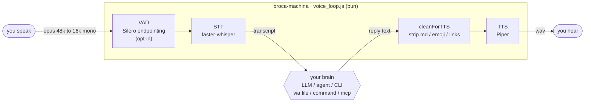

<p align="center">
  
</p>

<p align="center">
  <a href="https://github.com/codyslater/broca-machina/actions/workflows/ci.yml"></a>
  <a href="LICENSE"></a>
  
  
  
  
  
</p>

**Give any text "brain" a voice — and ears — inside a Discord voice channel.**

broca-machina joins a Discord voice channel, transcribes what you say with Whisper, hands the text
to whatever produces replies (an LLM, an agent, a shell command, a CLI, or an MCP host), and speaks
the answer back into the channel. The "brain" is completely behind a small transport
interface, so the same bridge works for a one-line `echo` toy or a full agent runtime.

It runs under Discord's now-mandatory **DAVE end-to-end encryption**, which most voice libraries
still can't negotiate — see [Troubleshooting: why bun](#troubleshooting) below.



- **Speech in:** received opus is decoded, downsampled to 16 kHz mono WAV via ffmpeg, and passed to
  your STT command (default: faster-whisper, CPU-friendly).
- **Text out / in:** transcripts reach your brain — and replies come back — through a pluggable
  **transport** (`file`, `command`, or `mcp`).
- **Speech out:** reply text is sanitized for speech (markdown, code fences, emoji, and links
  stripped) and rendered by your TTS command (default: Piper), then played into the channel.

Nothing in the core is app-specific: there are no hard-coded IDs or paths. Everything is driven by
one JSON config file.

---

## Quickstart

```bash
bun install                              # NOT npm — see "Why bun" below
cp config.example.json config.json       # then edit discord IDs / allowedUserId / stt.cmd / tts.cmd / transport
export DISCORD_VOICE_BOT_TOKEN=...        # your voice bot's token

bun src/voice_loop.js config.json        # run in the foreground
# — or, to background it with a boot/health check and log file:
scripts/voice-up.sh config.json          # scripts/voice-down.sh to stop
```

You'll also need **ffmpeg** on `PATH` and a Python environment with `faster-whisper` (STT) and
`piper-tts` (TTS). The full walkthrough — creating the Discord bot, intents, invite URL, Python env,
and config — is in **[SETUP.md](SETUP.md)**.

When it's live you'll see:

```
12:00:01 [loop] logged in as YourBot#1234
12:00:02 [loop] joined voice channel <your-channel-id> (startup)
12:00:02 [loop] LIVE
```

---

## Requirements

| Requirement | Why |
| --- | --- |
| **bun** | `@discordjs/voice` 0.19.2 needs Node ≥ 22.12 for DAVE. bun satisfies it; Node 20 + npm silently installs the broken 0.18.0. |
| **ffmpeg** on `PATH` | Downsamples received audio to 16 kHz mono, and does pitch-preserving speed changes for TTS. |
| **Python env** with `faster-whisper` + `piper-tts` | Default STT / TTS engines. Swap either by pointing `stt.cmd` / `tts.cmd` at your own binary. |
| **A dedicated Discord bot** (its own token) | Discord permits **one gateway connection per bot**. If you already run a text bot on the same application, create a *second* bot for voice. |

---

## Security

broca-machina is a pipe from **"any sound in a voice channel"** to **your brain** — treat that
seriously before you run it in a shared server:

- **Fail-closed speaker access.** The loop refuses to start unless you set `discord.allowedUserId`
  (only that user's speech is transcribed) **or** explicitly opt into open access with
  `discord.allowAnySpeaker: true`. Keep `allowedUserId` set for any real brain.
- **Accepted speech runs with your brain's privileges.** With a `command` or `mcp` brain — above all
  a tool-enabled agent like `claude -p` — a spoken utterance is an **untrusted prompt**. Anyone you
  let speak can attempt prompt injection (*"ignore your instructions and run…"*). Only open the mic
  (`allowAnySpeaker`) for a harmless brain such as the `echo` demo, and treat every transcript as
  untrusted input to your agent.
- **The token never lives in config.** It's read from the env var named by `discord.tokenEnv`
  (default `DISCORD_VOICE_BOT_TOKEN`) or from an out-of-repo `discord.tokenFile`; `config.json` is
  gitignored.
- **Local IPC only.** The warm STT/TTS/VAD servers talk over Unix sockets in `.voice-tmp/` — nothing
  binds a network port. broca-machina assumes a single-user host.
- **Use headphones.** With an open mic and speakers the bot can hear its own TTS and false-trigger
  barge-in; headphones (or `bargeIn: false`) avoid the echo.

See [SECURITY.md](SECURITY.md) to report a vulnerability.

---

## Config reference

Configure everything through one JSON file (path from `$VOICE_CONFIG` or the first CLI argument).
Start from `config.example.json`. Every field the loop reads is listed below; fields marked
*optional* have working defaults and can be omitted.

| Field | Type | Default | Meaning |
| --- | --- | --- | --- |
| `discord.guildId` | string | — (required) | Discord server (guild) ID the voice channel lives in. |
| `discord.channelId` | string | — (required) | Voice channel ID to join. |
| `discord.allowedUserId` | string \| null | `null` | Only transcribe this speaker's audio. **Required unless `allowAnySpeaker` is true** — the loop fails closed with neither set. |
| `discord.allowAnySpeaker` | boolean | `false` | Explicitly accept **any** speaker in the channel. Off by default; the loop refuses to start with neither this nor `allowedUserId`. Only use with a harmless brain (see [Security](#security)). *optional* |
| `discord.tokenEnv` | string | `"DISCORD_VOICE_BOT_TOKEN"` | Name of the environment variable holding the bot token. The token itself is **never** stored in config. |
| `discord.tokenFile` | string \| null | `null` | Fallback: path to an env-format file (`KEY=value`) the token is read from if `$tokenEnv` is unset — lets an MCP host that can't source a `.env` authenticate without a secret in the launch config. A leading `~` is expanded. *optional* |
| `stt.cmd` | string[] | — (required) | Argv for the transcriber. The loop appends the WAV path, so the command receives `[...cmd, <wav>]` and must print the transcript to stdout. |
| `stt.env` | object | `{}` | Extra environment variables for the STT process (e.g. `WHISPER_MODEL`, `WHISPER_COMPUTE`). *optional* |
| `tts.cmd` | string[] | — (required) | Argv for the synthesizer. The loop appends `<text> <out.wav>`, so the command receives `[...cmd, <text>, <out.wav>]` and must write a WAV to that path. |
| `tts.env` | object | `{}` | Extra environment variables for the TTS process (e.g. `PIPER_VOICE`, `PIPER_VOICE_DIR`). *optional* |
| `tts.speedFile` | string \| null | `null` | Path to a file containing a single float. Its contents are read fresh before each reply and passed as `VOICE_TTS_SPEED` (pitch-preserved playback speed). *optional* |
| `transport.type` | `"file"` \| `"command"` \| `"mcp"` | `"file"` | How transcripts reach your brain and replies come back. See [Transports](#transports). |
| `transport.transcriptDir` | string | — (required for `file`) | Directory each transcript is written to as `<timestamp>.txt`. |
| `transport.replyFile` | string | — (required for `file`) | File polled for reply text; consumed (deleted) after it's spoken. |
| `transport.cmd` | string[] | — (required for `command`) | Command run per transcript; the transcript is passed in `$VOICE_TRANSCRIPT` and the command's stdout is spoken as the reply. |
| `transport.source` | string | `"voice"` | *(mcp)* Label the host sees the spoken turn arrive under (`<channel source="…">`). *optional* |
| `transport.deliver` | `"channel"` | `"channel"` | *(mcp)* How a spoken turn is delivered to the host. `channel` (the only mode in v1) emits a `notifications/claude/channel` event for Claude Code / channel-aware hosts; it is the extension seam for future generic-host modes. *optional* |
| `onStart` | object \| — | — | A `{cmd, env, timeoutMs}` run **once, blocking** (up to `timeoutMs`, default 90 s) before connecting — e.g. boot the warm servers for an MCP session. *optional* |
| `playWavFile` | string \| null | `null` | Path to a file that *contains a WAV path*. Write a path there and the loop plays that WAV into the channel (pre-rendered clips, greetings). *optional* |
| `endSilenceMs` | number | `1000` | Milliseconds of silence that mark the end of an utterance. *optional* |
| `minUtteranceSec` | number | `0.4` | Utterances shorter than this are discarded before STT. *optional* |
| `maxReplyChars` | number | `700` | Reply text is truncated to this many characters before TTS. *optional* |
| `bargeIn` | boolean | `true` | When `true`, the user speaking during a reply **interrupts** playback immediately (barge-in). *optional* |
| `bargeInConfirm` | boolean | `true` | Confirm-before-kill barge-in: a speaking-start **ducks** playback and STT decides — real speech interrupts, a noise blob restores the volume. `false` = classic instant interrupt. *optional* |
| `bargeMinWords` | number | `4` | Confirm mode: a transcript only cuts playback if it has at least this many words, contains a wake word, or is a stop phrase (`stop`, `wait`, `hold on`…). Shorter turns still deliver. `0` disables the bar. *optional* |
| `duckFactor` | number | `0.3` | Playback volume while a speaking-start is being confirmed. Raise toward `0.55` in a noisy room where false ducks are common. *optional* |
| `duckAfterMs` | number | `350` | Speech must persist this long before the duck lands, so a door or mic bump never dims a reply. `0` = duck on the speaking-start edge. *optional* |
| `voiceFallback.channelId` | string \| null | `null` | Discord **text** channel that receives a reply when nobody is in the voice channel (bot not joined, or the allowed user left) instead of dropping it. Must be postable by the *voice* bot's token. *optional* |
| `voiceFallback.speakerRouteFiles` | string[] | `[]` | JSON files (keys `name`/`rc_name`/`tmux`) naming the session voice is routed to; the fallback banner credits it. Read at post time, first readable wins. *optional* |
| `cmdTimeoutMs` | number | `60000` | Hard cap on any STT/TTS/brain/ffmpeg subprocess; a hung child is killed and treated as empty output, so a wedged model or server can't strand the loop. *optional* |
| `playTimeoutMs` | number | `60000` | Cap on a single playback's safety window. The window itself is sized from the clip (WAV duration + 3 s, floor 5 s), so a wedged player costs seconds, not a minute; two consecutive timeouts recreate the audio player on the live connection. *optional* |
| `ackAfterMs` | number | `0` | Fast acknowledgement. If > 0, speak an ack phrase this many ms **after you stop talking** when the brain's real reply hasn't landed yet — a quick "still thinking" filler that overlaps STT + brain time so a slow (LLM/agent) brain doesn't leave the channel silent. A fast reply preempts it (no double-talk). Works for every transport. `0` disables. *optional* |
| `ackPhrase` | string \| string[] | `["One moment.", "Hmm, let me think.", "Just a sec.", "Okay, thinking."]` | The filler(s) spoken when `ackAfterMs` elapses. An array rotates randomly, never repeating back-to-back; a string pins one phrase. All pre-rendered at startup so firing one is instant. *optional* |
| `sttNoiseDrop` | string[] | `["", ".", "you", "thank you", "thanks", "bye", "you.", "thank you."]` | Case-insensitive transcripts to drop as Whisper silence-hallucinations. Transcripts shorter than 3 characters are also dropped, and the list is matched **per sentence** too: a transcript whose every sentence is a listed phrase or a sub-3-character fragment (`Thank you. Thank you.`) is dropped as a noise-loop hallucination. *optional* |
| `tmpDir` | string | `<config dir>/.voice-tmp` | Scratch directory for the transient utterance/reply WAVs. *optional* |
| `vad.enabled` | boolean | `false` | Silero-VAD endpointing (see [Latency levers](#latency-levers)). `false` keeps the fixed `endSilenceMs` trailing-silence endpointing. `true` ends an utterance the instant speech stops, streaming PCM to a warm `vad_server.py`. *optional* |
| `vad.threshold` | number | `0.5` | Speech-probability threshold to count a frame as speech. *optional* |
| `vad.negThreshold` | number \| null | `null` (→ `threshold − 0.15`) | Below this, a frame is silence; the band between is hysteresis. *optional* |
| `vad.minSilenceMs` | number | `300` | Trailing sub-threshold time that ends the utterance. *optional* |
| `vad.minSpeechMs` | number | `150` | Minimum speech before endpointing can fire (ignores blips). *optional* |
| `vad.socket` | string \| null | `null` (→ `.voice-tmp/vad.sock`) | Unix socket the loop connects to; must match the VAD server's. *optional* |
| `vad.connectTimeoutMs` | number | `500` | If the VAD server doesn't accept within this, the utterance falls back to `endSilenceMs`. *optional* |
| `ttsPipeline.enabled` | boolean | `false` | Sentence-boundary TTS pipelining (see [Latency levers](#latency-levers)). `true` synthesizes/plays long replies incrementally to cut time-to-first-audio. *optional* |
| `ttsPipeline.minChars` | number | `120` | Only replies at least this long are pipelined; shorter ones stay one-shot. *optional* |
| `ttsPipeline.maxChunkChars` | number | `240` | Sentences are merged up to (and oversize ones hard-split at) this many characters per synth chunk. *optional* |

Presence-gating adds `autoJoin`, `idleLeaveMs`, `presenceFile`, `onPresenceEnter`, and
`onPresenceLeave` — see [Presence-gated auto-join](#presence-gated-auto-join).

### STT / TTS engine knobs

The bundled engines read their own environment variables (set them via `stt.env` / `tts.env`):

- **`src/stt.py`** (faster-whisper): `WHISPER_MODEL` (default `small.en`), `WHISPER_DEVICE`
  (default `cpu`), `WHISPER_COMPUTE` (default `int8`). `WHISPER_MODEL` is the STT
  **speed/accuracy lever** — `base.en` transcribes ~2.8× faster than `small.en` with
  near-identical output on short utterances; `tiny.en` is faster still and rougher. Default
  stays `small.en`. The warm `stt_server.py` reads it too, so switch it in `stt.env` and restart
  the warm servers.
- **`src/tts.py`** (Piper): `PIPER_VOICE` (default `en_US-amy-medium`), `PIPER_VOICE_DIR`
  (default `~/.cache/broca-machina/piper`), `VOICE_TTS_SPEED` (default `1.0`). The voice model is
  auto-downloaded on first use.

### Latency levers

Three opt-in, default-off knobs cut round-trip latency with no hardware change (full analysis in
[docs/LATENCY.md](docs/LATENCY.md)):

1. **`WHISPER_MODEL=base.en`** (in `stt.env`) — ~2.8× faster STT, default unchanged.
2. **`vad.enabled: true`** — Silero-VAD endpointing ends an utterance as soon as you stop talking
   instead of waiting the fixed `endSilenceMs`. Reuses the Silero model **vendored by
   faster-whisper** (no new dependency; `onnxruntime` only). Requires the warm VAD server:
   `scripts/warm-servers.sh start vad` (or set `VOICE_WARM_VAD=1` so plain `start` includes it).
   If the server is down, endpointing safely falls back to `endSilenceMs`. Thresholds are config
   knobs and benefit from a live tune with a real speaker.
3. **`ttsPipeline.enabled: true`** — synthesize + play long replies sentence-by-sentence so
   time-to-first-audio is one sentence, not the whole reply. Preserves ordering and barge-in.

**Perceived** latency (distinct from the three above): **`ackAfterMs: 600`** speaks a short
filler ~0.6 s after you stop talking when the reply is still being computed — so a slow
brain acknowledges you almost immediately while STT + the model run in the background. The
default `ackPhrase` set rotates a few phrases ("One moment." / "Hmm, let me think." / …) so it
doesn't chant the same line every turn; all are pre-rendered at startup, a fast reply preempts
them, and it's off by default (best for LLM/agent brains; leave off for a fast echo/command brain).

---

## Transports

A transport is the seam between the voice bridge and your brain. Pick one with `transport.type`.

### `file` (default)

Transcripts are written to `transcriptDir/<timestamp>.txt`. Replies are read from `replyFile` —
the loop polls that path, and whenever it appears, speaks its contents and deletes it. **Whatever
writes `replyFile` becomes the voice.** This is the loosest coupling: your brain can be any process,
in any language, that watches a directory and drops a text file. See
[`examples/file-transport/`](examples/file-transport/) for a reference host loop.
The file transport also supports **routing between multiple brains** — local
or over SSH — see [docs/INTEGRATIONS.md](docs/INTEGRATIONS.md#routing-between-multiple-brains).

### `command`

Each transcript is handed to `transport.cmd` as the environment variable `$VOICE_TRANSCRIPT`. The
command's **stdout** is spoken as the reply. Best for a stateless "one utterance in, one reply out"
brain:

```json
"transport": {
  "type": "command",
  "cmd": ["bash", "-lc", "my-llm-cli --prompt \"$VOICE_TRANSCRIPT\""]
}
```

### `mcp`

A Model Context Protocol transport where **the voice loop itself becomes an MCP server**. A
channel-aware host (e.g. Claude Code) launches broca-machina via `.mcp.json`; spoken turns arrive at
the host as a `notifications/claude/channel` event, and the host replies by calling the **`speak`**
tool, which voices the text back into the channel.

```json
"transport": { "type": "mcp", "source": "voice", "deliver": "channel" }
```

Register it with your host: copy [`.mcp.json.example`](.mcp.json.example) to `.mcp.json`, set an
absolute `cwd`, and point it at
[`adapters/mcp.config.example.json`](adapters/mcp.config.example.json) (edit the Discord IDs +
`stt`/`tts` first):

```json
{
  "mcpServers": {
    "broca-machina": {
      "command": "bun",
      "args": ["src/voice_loop.js", "adapters/mcp.config.example.json"],
      "cwd": "/abs/path/to/broca-machina"
    }
  }
}
```

The **`speak`** tool is the *only* capability exposed to the host — it voices text and nothing else
(no file or command access). Inbound speech uses an experimental `claude/channel` notification, so
the MCP path is first-class with **Claude Code / channel-aware hosts** today; a host that can't
receive channel events still gets `speak`. The `transport.deliver` switch is the extension seam for
future generic-host inbound modes — see
[docs/ARCHITECTURE.md](docs/ARCHITECTURE.md#extending-to-generic-mcp-hosts).

---

## Warm model servers (lower latency)

`stt.py` / `tts.py` load their models on **every** call (~1.1 s each). To skip that cost, run
persistent servers that keep faster-whisper and Piper warm, and point the config at the drop-in
clients:

```bash
VOICE_PY=/path/to/python \
PIPER_VOICE_DIR=/path/to/piper WHISPER_MODEL=base.en \
  scripts/warm-servers.sh start        # start | stop | status | restart
```

Then in `config.json`, swap the commands (identical CLI, so it's a 1-line change each):

```json
"stt": { "cmd": ["/path/to/python", "src/stt_client.py"] },
"tts": { "cmd": ["/path/to/python", "src/tts_client.py"] }
```

The clients talk to the servers over Unix sockets in `.voice-tmp/` and **fall back to a cold
in-process load** if a server is down — pure upside, never a new failure mode. Measured ~2.2×
faster STT+TTS per exchange (≈4× with `WHISPER_MODEL=base.en`). See
[`docs/LATENCY.md`](docs/LATENCY.md) for the cold-vs-warm numbers and the ranked list of further
no-hardware wins.

---

## Presence-gated auto-join

By default the bot joins the voice channel at startup and stays there for the whole session. A
long-lived idle voice connection is fine functionally, but it silently rots — Discord drops inactive
voice sessions and net blips go unnoticed until you try to talk — and it holds the warm-server RAM
even when nobody's around.

Set **`autoJoin: true`** for a presence-gated lifecycle instead (presence is keyed to
`allowedUserId`; with `allowAnySpeaker: true` it tracks any non-bot member of the channel):

- The **gateway** stays connected as a cheap presence listener — no voice UDP, no models loaded.
- When the allowed user **joins** the voice channel, the bot fires `onPresenceEnter` (detached) and
  joins. The hook is meant for warming models: because it runs concurrently with the multi-second
  voice handshake and the human gap before the first word, warm-up is effectively free, so the first
  utterance lands on warm servers.
- When the user **leaves**, an idle timer starts. If they haven't returned within `idleLeaveMs`
  (default 600000 = 10 min), the bot leaves the channel and fires `onPresenceLeave` (e.g. spin the
  warm servers down to reclaim RAM). A quick rejoin cancels the pending leave, so brief drops don't
  thrash the connection.
- **`presenceFile`** (optional, any mode): a marker file kept in existence exactly while the user
  is in the voice channel — lets external tooling gate on "is the human here" without polling
  Discord. Removed on graceful shutdown.

```json
"allowedUserId": "YOUR_DISCORD_USER_ID",
"autoJoin": true,
"idleLeaveMs": 600000,
"onPresenceEnter": { "cmd": ["bash", "scripts/warm-servers.sh", "start"], "env": {} },
"onPresenceLeave": { "cmd": ["bash", "scripts/warm-servers.sh", "stop"],  "env": {} }
```

If the user speaks in the ~2.5 s before the warm STT server is up, the drop-in client falls back to
a cold in-process load for that one utterance — it's slower but never dropped, so no first-word
queue is needed. Leave `autoJoin` unset (false) to keep the always-in-channel behavior.

---

## Adapters

`adapters/` holds ready-to-copy config templates for specific host wirings.
[`adapters/mcp.config.example.json`](adapters/mcp.config.example.json) is a complete **MCP-transport**
setup (the voice loop as an MCP server): copy it, set your Discord IDs, point `stt`/`tts` at your
Python, and register it with your host via [`.mcp.json.example`](.mcp.json.example). Nothing in
`src/` is host-specific — every wiring is just a JSON config.

---

## Troubleshooting

**The bot connects but immediately drops / close code 4017 / "never Ready".**
This is the DAVE end-to-end-encryption handshake failing — almost always because the wrong
`@discordjs/voice` shipped. Confirm you installed with **bun** (`bun install`) and that
`node_modules/@discordjs/voice/package.json` reads **0.19.2**, not 0.18.x. `npm install` on Node 20
silently resolves to the pre-DAVE 0.18.0, which cannot complete the handshake on today's Discord.

**Why bun, and why the exact versions?**
Discord made DAVE E2EE mandatory for voice in early 2026. Support landed in `@discordjs/voice` 0.19,
which bundles `@snazzah/davey` and requires **Node ≥ 22.12**. bun is a modern runtime that satisfies
that requirement out of the box, so `bun install` + `bun src/voice_loop.js` is the supported path.
Running under an older Node lets the resolver fall back to 0.18.0 (no DAVE) and the join fails. See
[docs/ARCHITECTURE.md](docs/ARCHITECTURE.md#the-dave--bun-rationale) for the full rationale.

**It logs in but "no bot token in $DISCORD_VOICE_BOT_TOKEN" / login FAILED.**
Export the token into the env var named by `discord.tokenEnv` (default `DISCORD_VOICE_BOT_TOKEN`)
before launching, or point `voice-up.sh` at a `.env` with `VOICE_TOKEN_ENVFILE=/path/to/.env`.

**It refuses to start: "no discord.allowedUserId set".**
That's the fail-closed guard (see [Security](#security)). Set `discord.allowedUserId` to your user
ID, or `discord.allowAnySpeaker: true` to explicitly accept anyone.

**I already run a Discord bot and broca-machina won't stay connected.**
Discord allows **one gateway connection per bot**. If your existing text bot is already connected on
that application's token, create a **second** Discord bot (its own application + token) for voice.
Two bots, two gateways.

**No audio is transcribed.**
Check that (a) the bot actually joined the channel (the `[loop] joined`
line — with `autoJoin`, that only appears once you're in the voice channel), (b) if `allowedUserId`
is set, that *you* are that user, and (c) you're speaking longer than
`minUtteranceSec`. Very short or silent-ish utterances and the `sttNoiseDrop` list are filtered out
by design — the log prints `[recv] … too short` or `[stt] drop: "…"` when that happens.

**ffmpeg not found.**
ffmpeg is probed at startup — if it's missing the loop exits immediately with a clear message
rather than failing per-utterance later. Install it (`apt install ffmpeg` / `brew install ffmpeg`)
and restart.

**It's slow on CPU.**
The defaults are CPU-only. `src/stt.py` reloads the Whisper model on **every** utterance (a
deliberate simplicity trade-off noted in the file), so expect a few seconds of round-trip latency.
For lower latency: use a smaller/faster Whisper model (`WHISPER_MODEL=tiny.en`), run STT on a GPU
(`WHISPER_DEVICE=cuda`), replace `stt.cmd` with a persistent transcription server, or enable the
[warm servers](#warm-model-servers-lower-latency).

---

## Project layout

```
src/voice_loop.js       the bridge (bun): receive → STT → transport → TTS → play
src/stt.py              default STT (faster-whisper), per-call model load
src/tts.py              default TTS (Piper), per-call load, pitch-preserved speed control
src/stt_server.py       warm STT server: loads the model once, serves over a Unix socket
src/tts_server.py       warm TTS server: loads Piper once, serves over a Unix socket
src/stt_client.py       drop-in for stt.py; talks to the warm server, cold fallback if down
src/tts_client.py       drop-in for tts.py; talks to the warm server, cold fallback if down
src/vad.py              Silero-VAD endpointer (opt-in early end-of-utterance)
src/vad_server.py       warm VAD server: streams PCM in, reports end-of-speech
src/vad_stream.js       loop-side VAD client (Unix-socket framing)
src/_voicesock.py       shared length-prefixed-JSON socket framing for server/client
scripts/warm-servers.sh start/stop/status the warm STT+TTS(+VAD) servers
scripts/voice-up.sh     background-start with a boot/health check + log
scripts/voice-down.sh   stop the backgrounded loop
config.example.json     copy to config.json and edit
requirements.txt        python deps for the bundled engines (faster-whisper, piper, …)
adapters/               ready-to-copy config templates (e.g. mcp.config.example.json)
examples/               runnable brains: echo, ollama, claude-cli, file-transport
test/                   selftests (lifecycle, TTS pipeline + ack, VAD) — CI runs these
.mcp.json.example       example MCP registration for a channel-aware host (Claude Code)
assets/                 logo + icon (SVG)
docs/ARCHITECTURE.md    pipeline, transport abstraction, DAVE/bun rationale
SETUP.md                end-to-end setup walkthrough
CONTRIBUTING.md         dev setup, adding transports/engines, PR expectations
```

## License

MIT — see [LICENSE](LICENSE). © 2026 Cody Slater.
