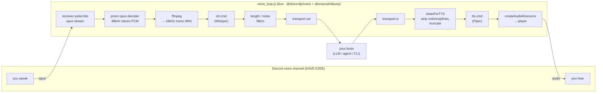

# Architecture

broca-machina is a single event loop (`src/voice_loop.js`, run under bun) that turns a Discord
voice channel into a bidirectional text interface. Speech becomes text; text becomes speech. The
thing that produces replies — the "brain" — lives entirely outside the loop, behind a small
**transport** seam. This document explains the pipeline, the transport abstraction, the DAVE/bun
runtime choice, and exactly where a host plugs its brain in.

---

## The pipeline



Text fallback (same flow, one glance):

```
   INBOUND  (speech → text)                         OUTBOUND (text → speech)
   ─────────────────────────                        ──────────────────────────
   receiver.subscribe(user)                         transport.in delivers reply
        │ opus                                            │
   prism opus decoder → 48kHz stereo PCM             cleanForTTS (strip md/emoji/links, cap len)
        │                                                 │
   ffmpeg → 16kHz mono WAV                            tts.cmd  → out.wav   (Piper)
        │                                                 │
   stt.cmd → transcript   (Whisper)                  createAudioResource → player.play
        │                                                 │
   length + sttNoiseDrop filters                     played into the voice channel
        │
   transport.out → your brain
```

### Inbound: speech → text

1. **Speaking start.** `conn.receiver.speaking.on('start', userId)` fires when someone begins
   talking. The loop ignores the event if the speaker isn't `allowedUserId` (when set), or if the
   bot is currently speaking (`botSpeaking`) or already capturing (`capturing`) — this is what keeps
   the bot from transcribing its own TTS.
2. **Capture.** It subscribes to that user's opus stream with
   `EndBehaviorType.AfterSilence` / `duration: endSilenceMs` (default 1000 ms), so the stream ends
   after a pause.
3. **Decode + resample.** Opus is decoded to 48 kHz stereo PCM via `prism-media`, then piped through
   **ffmpeg** to a **16 kHz mono WAV** — the format Whisper expects.
4. **Guard rails.** Utterances shorter than `minUtteranceSec` (default 0.4 s) are dropped before STT.
5. **Transcribe.** The WAV path is appended to `stt.cmd` and run; stdout is the transcript.
6. **Noise filtering.** Transcripts under 3 characters, or matching the case-insensitive
   `sttNoiseDrop` list (default: common Whisper silence-hallucinations like `"you"`,
   `"thank you"`), are discarded. Otherwise the text goes to `transport.out`.

### Outbound: text → speech

1. **Reply arrives** through `transport.in` (see below), landing in a single-slot `pendingReply`
   for the `command` and `mcp` transports, or read from `replyFile` for the `file` transport.
2. **Sanitize for speech.** `cleanForTTS` strips code fences, inline code, bold/italic markers,
   emoji, and turns URLs into the spoken word "a link", collapses whitespace, and truncates to
   `maxReplyChars` (default 700) — so the synthesizer never tries to read markdown or a URL aloud.
3. **Synthesize.** `tts.cmd` is run as `[...cmd, <text>, <out.wav>]`; it writes a WAV.
4. **Play.** The WAV is wrapped in a `createAudioResource` and played through the connection's
   `AudioPlayer`. `botSpeaking` is held true for the duration so inbound capture is suppressed.

### Two auxiliary loops

- **`pollReply()`** (every ~300 ms) drives the outbound side: it speaks a `pendingReply`, or, for
  the `file` transport, consumes `replyFile` when it appears.
- **`pollPlayWav()`** (every ~400 ms) is optional. If `playWavFile` is set, the loop reads that
  file's *contents as a WAV path* and plays that WAV — a side channel for pre-rendered clips or a
  cloned-voice greeting, independent of the STT/TTS path.

Transient WAVs (utterances and replies) are written to `tmpDir` (default `<config dir>/.voice-tmp`)
and unlinked after use.

---

## The transport abstraction

The loop never knows what the brain is. It only knows how to *hand out* a transcript and *receive
back* a reply. That seam is the transport, selected by `transport.type`:

| Direction | `file` | `command` | `mcp` |
| --- | --- | --- | --- |
| **out** (transcript → brain) | write `transcriptDir/<ts>.txt` | run `transport.cmd` with `$VOICE_TRANSCRIPT`; capture stdout | emit a `notifications/claude/channel` event to the host |
| **in** (reply → speech) | poll & consume `replyFile` | stdout of the same `transport.cmd` run | the host calls the `speak` tool |

- **`file`** is fully decoupled and asynchronous: your brain is any process that watches a directory
  and writes a reply file. Producer and consumer never call each other directly. Whatever writes
  `replyFile` becomes the voice.
- **`command`** is synchronous request/response: one transcript in (`$VOICE_TRANSCRIPT`), one reply
  out (stdout). Good for stateless CLIs.
- **`mcp`** makes the loop *itself* an MCP server: it advertises a `speak(text)` tool and pushes each
  transcript to the host as a `notifications/claude/channel` event. Implemented in `initMcp()` and
  `deliverInboundMcp()` (`src/voice_loop.js`); replies come back through the `speak` tool.

Adding a transport means teaching two functions about the new type: `sendTranscript()` (out) and the
polling in `pollReply()` (in). See [CONTRIBUTING.md](../CONTRIBUTING.md#how-to-add-a-transport).

### Extending to generic MCP hosts

In `mcp` mode the loop is an MCP server, but *inbound* speech — getting the transcript to the brain —
currently uses one mechanism: an experimental `notifications/claude/channel` event, which Claude Code
and other channel-aware hosts understand. A host without channel support still gets the `speak` tool,
but no standard way to *receive* what the user said.

`deliverInboundMcp()` (`src/voice_loop.js`) is the seam for closing that gap. It switches on
`transport.deliver`; v1 implements only `"channel"`, and any other value throws rather than silently
no-op. A future generic-host mode — e.g. a request/response `listen` tool the host polls, or MCP
sampling — plugs in as one more `case` there, with no change to the rest of the loop. That's why the
config carries a `deliver` knob even though it has a single value today.

### The STT / TTS contract

Engines are just external commands with a fixed argument contract, so any language works:

- **STT:** `stt.cmd` invoked as `[...cmd, <wav>]` → print the transcript to **stdout**.
- **TTS:** `tts.cmd` invoked as `[...cmd, <text>, <out.wav>]` → write a **WAV** to `<out.wav>`.

The bundled `src/stt.py` (faster-whisper) and `src/tts.py` (Piper) implement these. To use a cloned
voice or a GPU server, point `tts.cmd` / `stt.cmd` at your own binary — no loop changes needed. Extra
per-process environment comes from `stt.env` / `tts.env`, and `tts.speedFile` is re-read before each
reply and passed as `VOICE_TTS_SPEED` for live speed control (pitch preserved via ffmpeg `atempo`).

---

## The DAVE / bun rationale

Discord made **DAVE** (their end-to-end encryption protocol for audio/video) **mandatory** for voice
connections in early 2026. A client that can't negotiate DAVE can't stay in a voice channel — the
gateway drops the connection (you'll typically see close code **4017** or a connection that never
reaches `Ready`).

DAVE support in the discord.js stack landed in **`@discordjs/voice` 0.19**, which bundles
**`@snazzah/davey`** for the protocol handling. That version **requires Node ≥ 22.12**.

The trap: on an older Node (e.g. 20), `npm install` won't install 0.19 — its engine constraint
fails and the resolver silently falls back to the last compatible release, **0.18.0**, which predates
DAVE. Everything installs cleanly and the bot logs in, but the voice join fails, because 0.18.0
literally cannot speak DAVE.

The fix, and why this project standardizes on it:

- **Run under bun.** bun is a modern runtime that satisfies the ≥ 22.12 requirement, so `bun install`
  resolves the correct **`@discordjs/voice` 0.19.2** (pinned in `package.json`) and `bun
  src/voice_loop.js` runs it. The `start` script and `scripts/voice-up.sh` both invoke `bun`.
- **Pinned versions.** `package.json` pins `@discordjs/voice` to `0.19.2` and depends on
  `@snazzah/davey`, plus `libsodium-wrappers` and `opusscript` (encryption/codec) and `prism-media`
  (opus decode). A quick sanity check after install:
  `cat node_modules/@discordjs/voice/package.json | grep version` should read `0.19.2`.

If you must run under Node, use Node ≥ 22.12 and verify the installed `@discordjs/voice` version — but
bun is the supported and tested path.

---

## Where a host plugs in

You don't modify `src/` to integrate a brain — you write a **config** (and, for the `file`
transport, a small watcher). The integration surface is exactly:

1. **Choose a transport** and point it at your brain:
   - `command`: give a CLI that reads `$VOICE_TRANSCRIPT` and prints a reply.
   - `file`: give a `transcriptDir` your brain watches and a `replyFile` your brain writes.
2. **(Optional) swap engines** via `stt.cmd` / `tts.cmd` for a custom voice, GPU model, or another
   language.
3. **(Optional) push audio directly** by writing a WAV path into `playWavFile` — bypasses STT/TTS for
   pre-rendered speech.

A worked example lives in
[`adapters/mcp.config.example.json`](../adapters/mcp.config.example.json): it uses the `mcp`
transport so a channel-aware host (e.g. Claude Code) drives the voice channel through the `speak`
tool, while the `file` and `command` transports keep the brain equally decoupled behind a directory
or a single command. That is the intended integration pattern: **the brain and the bridge only ever
meet at files, a command, or an MCP tool — never a shared import.**
